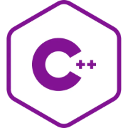

# C++ Dev Environment Installer

[](https://github.com/Zero-iinfinity/cpp-dev-setup/releases)
[](https://github.com/Zero-iinfinity/cpp-dev-setup/releases)
[](LICENSE)

<table>
  <tr>
    <td width="150">
      
    </td>
    <td>
      <h2>One-click C++ development environment setup for Windows.</h2>
      Setting up C++ on Windows is confusing — wrong paths, missing compilers,
      broken extensions. This installer handles everything automatically, so you
      can start writing code in minutes.
    </td>
  </tr>
</table>

---

## What It Installs

| Component | Purpose |
|---|---|
| MSYS2 (GCC, G++, GDB) | C++ compiler & debugger |
| Visual Studio Code | Code editor |
| C/C++ Extension (Microsoft) | IntelliSense, debugging support |
| Project folder | Pre-configured folder on Desktop |

---

## Prerequisites

- Windows 10 or later (64-bit)
- Internet connection during installation
- ~2 GB free disk space

---

## Steps to Install

1. Download the latest `.exe` from [**Releases**](https://github.com/Zero-iinfinity/cpp-dev-setup/releases)
2. Run the installer as **Administrator**
3. When the **MSYS2 setup window** appears:
   - Install with **default settings**
   - At the end, **uncheck** `Run MSYS2 now` before clicking Finish
4. Let the installer complete — a ready-to-use project folder will appear on your Desktop

> **Note:** If you already have VS Code installed in its default location, you can uncheck the VS Code option during setup to skip reinstalling it.

---

## Project Structure
```text
cpp-dev-setup/
├── cpp-dev-setup.iss
├── assets/
├── msys2_setup.ps1
├── final_setup.ps1
├── LICENSE           
└── README.md
```

---

## Troubleshooting

**MSYS2 install fails**
→ Temporarily disable antivirus and retry

**VS Code extensions not installed**
→ Open VS Code, press `Ctrl+Shift+X`, search `C/C++` and install manually

---

## Contributing

Pull requests are welcome! For major changes, please open an issue first.

---

## 📄 License

[MIT](LICENSE)
